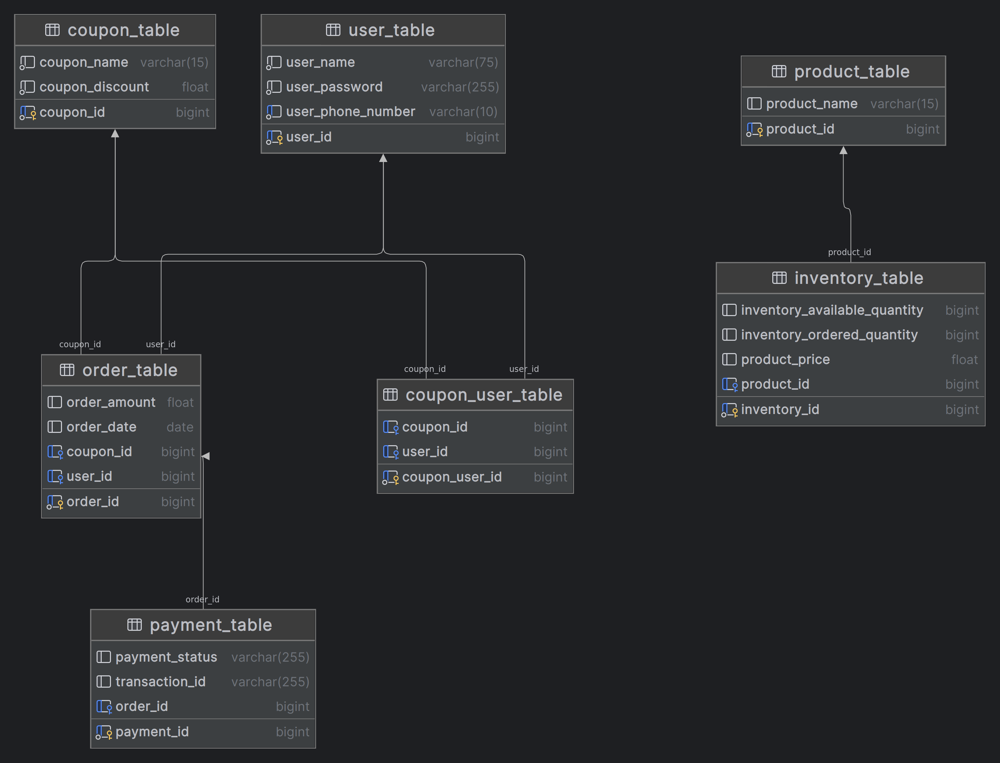

# Shopping App

## **Description**

Shopping App Backend which is created using Java and Spring Framework in which users can
perform the following actions:
● Enter the quantity of products the user wants to order
● Check if the product is available in the desired quantity
● Check available coupons and apply one, if valid. A coupon can only be applied once per
user
● Make payment for the order
● View the status of all orders

---

## **API Documentation:**

### Inventory Related Endpoints:

1. **GET /api/shopping-app/inventory**
    - Description: Retrieves inventory data.
    - Response:
        - Status Code: 200 OK
        - Data: List of inventory items with their details.
2. **POST /api/shopping-app/createCoupons**
    - Description: Adds coupons to the system.
    - Request Body: List of coupon objects.
    - Response:
        - Status Code: 200 OK
        - Data: Confirmation message indicating successful addition of coupons.
3. **GET /api/shopping-app/fetchCoupons**
    - Description: Retrieves available coupons.
    - Response:
        - Status Code: 200 OK
        - Data: Map of coupon names and their respective discounts.

### User Related Endpoints:

1. **POST /api/shopping-app/createNewUser**
    - Description: Creates a new user.
    - Request Body: User details.
    - Response:
        - Status Code: 200 OK
        - Data: Confirmation message with the ID of the newly created user.

### Order Related Endpoints:

1. **POST /api/shopping-app/{userId}/order**
    - Description: Places an order for a user.
    - Path Parameters:
        - userId: ID of the user placing the order.
    - Request Parameters:
        - qty: Quantity of items to order.
        - coupon: Coupon code (if applicable).
    - Response:
        - Status Code: 200 OK
        - Data: Details of the placed order.
2. **POST /api/shopping-app/{userId}/{orderId}/pay**
    - Description: Processes payment for an order.
    - Path Parameters:
        - userId: ID of the user making the payment.
        - orderId: ID of the order to be paid.
    - Request Parameter:
        - amount: Amount to be paid.
    - Response:
        - Status Code: 200 OK (for successful payment)
        - Data: Payment transaction details.
3. **GET /api/shopping-app/{userId}/order**
    - Description: Retrieves orders for a specific user.
    - Path Parameter:
        - userId: ID of the user.
    - Response:
        - Status Code: 200 OK
        - Data: List of orders made by the user.
4. **GET /api/shopping-app/{userId}/orders/{orderId}**
    - Description: Retrieves a specific order by user and order ID.
    - Path Parameters:
        - userId: ID of the user.
        - orderId: ID of the order.
    - Response:
        - Status Code: 200 OK
        - Data: Details of the specified order.

---

## **Assumptions:**

1. Implemented a **`run`** method within a Spring **`ApplicationRunner`** implementation to handle data initialisation upon application startup.
2. Checked if data initialisation is necessary by verifying if it hasn't been done before (**`alreadyInitialized`** flag).
3. Created a method **`initializeData`** to encapsulate the logic for initialising data.
4. Checked the count of records in various repositories (**`userRepository`**, **`productRepository`**, **`inventoryRepository`**, **`couponRepository`**) to determine if data exists.
5. If repositories are empty, created and saved sample data including a user, a product, an inventory item, and coupons.
6. Utilised a separate method **`saveCoupon`** to encapsulate the logic for creating and saving coupon objects, enhancing code readability and maintainability.
7. Each coupon has a unique name (**`couponName`**), and the name is limited to 15 characters.
8. Each user has a unique phone number (**`userPhoneNumber`**), and the phone number is limited to 10 characters.
9. The price of a product (**`productPrice`**) is stored as a floating-point number.
10. Each order can be associated with only one coupon.
11. Each payment is associated with only one order.
12. The password of a user (**`userPassword`**) is stored as a plain text.

---

## Project Setup :

**1. Prerequisites:**

- JDK (Java Development Kit) installed on your system
- Maven (Dependency Management Tool) installed
- Any IDE (Integrated Development Environment) such as IntelliJ IDEA, Eclipse, or Spring Tool Suite

**2. Setup Instructions:**

- Clone the project repository from GitHub Repository URL or download the source code as a ZIP file.
- Open the project in your preferred IDE.
- Ensure that JDK and Maven are properly configured in your IDE.

**3. Database Setup:**

- The project uses an MySQl database. Configure your MySQl username and password in **application.properties** file.

**4. Running the Application:**

- Run the **`ProjectApplication.java`** class to start the Spring Boot application.
- The application will be accessible at **`http://localhost:8081`**.

---

**Accessing Swagger**

Once the application is running, you can access the Swagger documentation at [http://localhost:8081/swagger-ui/index.html](http://localhost:8081/swagger-ui/index.html). This endpoint provides a user-friendly interface to interact with the defined API endpoints and understand their functionalities.

---
